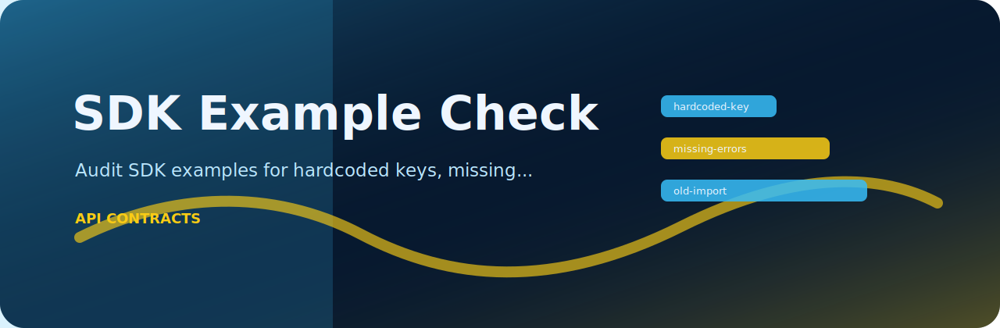
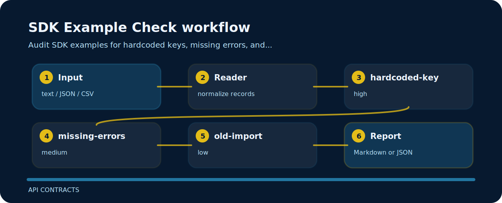

# SDK Example Check

Audit SDK examples for hardcoded keys, missing errors, and outdated imports.



## Policy flow



## Review notes

- `hardcoded-key` - API key appears hardcoded (high); load credentials from environment.
- `missing-errors` - error handling is missing (medium); show exception handling.
- `old-import` - outdated import noted (low); update SDK import path.

## Files to open first

```text
.github/        CI workflow
examples/       sample inputs
src/            package source
tests/          test coverage
```

## One-pass run

```bash
git clone https://github.com/mertefekurt/sdk-example-check.git
cd sdk-example-check
python -m pip install -e ".[dev]"
sdk-example-check examples/sample.txt
```
